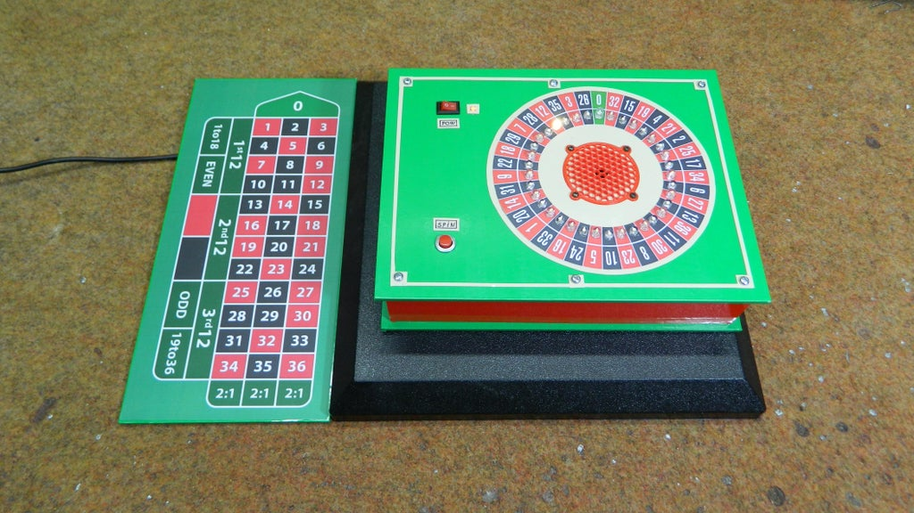

# Arduino Nano Roulette Project

## About the Project

This project is an exciting simulation of a roulette game using Arduino. The main objective of the project is to represent a roulette wheel using the rotation of LEDs. The project only requires button presses for interaction. This repository includes the circuit diagram, Arduino code, and other project-related resources.

## Requirements

To run the project, you will need the following components:

- Arduino Nano microcontroller
- 5x 74HC595 shift registers
- 37x LEDs
- 1x 220 ohm resistor
- Buzzer

## Circuit Diagram

The circuit diagram is shown below:

The circuit diagram image is available in the file "circuit.png".

## Arduino Code

The Arduino code is available in the file "casino.ino". You can use the Arduino IDE or any compatible platform to open and upload the code to your Arduino Nano microcontroller. Once the code is uploaded, your roulette wheel will start spinning, and you'll be ready to place your bets!

## Important Notes

- Be mindful of the correct voltage and current values while running the project.
- Avoid incorrect connections during the circuit assembly.
- Do not use this project for any form of gambling; it's purely for entertainment purposes.

## Contribution

If you would like to contribute to this project or fix any issues, feel free to submit a "Pull Request" on GitHub or open an "Issue" to discuss the changes.

</img>

